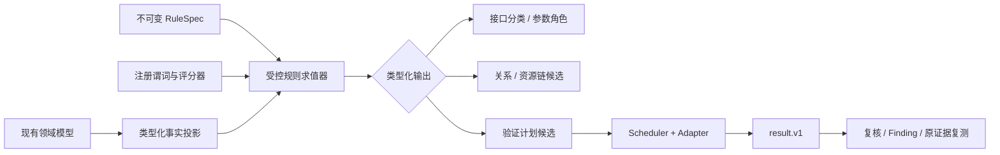

# 抽象规则分析框架设计与新会话交接

状态：P0 已实现，尚未接入持久化统一分析主链
更新日期：2026-08-12

## 1. 结论

早期“接口行为分类 + 请求/响应参数事实 + 值集合关系 + 请求组合 + 受控验证”的思路
可行，而且与当前项目已经形成的领域模型高度一致。项目不需要重新建立一套 Path、Req、
Res、ReqP、ResP 表；现有 `raw_data`、`req_data`、`res_data`、`parameter_relation`、
typed locator、fixture、snapshot、scheduler 和 `result.v1` 已经提供了事实与执行基础。

建议实现一个混合式框架：

1. 从现有模型投影类型化事实，不复制原始数据；
2. 用声明式 JSON `RuleSpec` 组合规则；
3. 复杂计算只能调用经过注册、测试和版本化的 Python 谓词；
4. 离线规则只能产生候选、分类和计划，不能确认漏洞；
5. 在线验证必须转换为现有 scheduler adapter；
6. 结果必须通过 `result.v1`，再进入复核和 finding 生命周期。

不建议实现可执行任意 Python、`eval`、Jinja 表达式或数据库查询字符串的“万能规则
DSL”。它难以审计、难以限制数据访问，也会形成第二套执行引擎。

## 2. 早期概念到当前模型的映射

| 早期概念 | 当前实现 | 处理决定 |
| --- | --- | --- |
| `Path` | `raw_data` / `ProjectAssetLink` | 保留项目、环境、方法、路径和可扩展 action |
| `Req` / `Res` | snapshot、observation、sample | 原始正文保持私有，不建立新的公开原文表 |
| `ReqP` / `ResP` | `req_data` / `res_data` | 使用 direction、canonical name、schema path 和 typed locator |
| `ReqPV` / `ResPV` | 观测值、`parameter_archive`、私有证据 | 真实值只属于项目私有运行数据；规则输出只留摘要和引用 |
| `Priority` | `parameter_priority_item` / review | 区分业务重要性、数据就绪度和执行优先级 |
| 参数分析结果 | `parameter_relation` | 明确为有方向的 `response producer -> request consumer` 候选边 |
| 请求组合表 | fixture revision + request snapshot | 使用不可变版本，不再维护可漂移的组合行 |
| 同角色前提 | principal/profile/scope selector | 支持 same、different 或显式关系，不固定角色层数 |
| swap 校验 | parameter validation / authorization matrix adapter | 通过 scheduler 执行来源读取、消费访问和证据判断 |

原始字段中的 `methon`、`heades`、自由文本 `position` 和 `relation` 不应继续扩展；新规则
只读取规范化字段和 typed locator。

## 3. 目标与非目标

### 3.1 目标

- 统一接口分类、参数身份、参数关系、资源链和测试计划候选的规则协议；
- 允许新增规则包，而不修改分析主循环；
- 每次匹配都可解释：规则版本、输入事实、分数贡献、原因码和输出对象；
- 支持项目、环境、身份、scope 和数据来源隔离；
- 支持离线回放语料、人工纠偏和规则版本比较；
- 复用现有 scheduler、adapter、snapshot、result 和 finding 生命周期。

### 3.2 非目标

- 不把规则引擎变成通用脚本执行平台；
- 不允许规则直接读取凭据或仓库外原始证据；
- 不允许离线规则把关系标成 `verified` 或创建漏洞；
- 不用一个通用 `RuleMatch` 替代全部类型化领域对象；
- 第一版不自动执行修改、删除、审批、导出等有副作用动作；
- AI 不直接激活规则、不直接确认漏洞，也不生成可执行表达式。

## 4. 总体结构



### 4.1 类型化事实投影

事实投影是只读视图或不可变 dataclass，不新增第二份原始数据：

- `EndpointFact`：project、env、pathid、method、path template、action、media type；
- `ParameterOccurrenceFact`：direction、canonical name、type、required、typed locator；
- `ObservationSummaryFact`：来源、时间、状态类别、值 digest、长度、集合统计；
- `PrincipalContextFact`：principal/profile revision、role、rank、scope 和标签；
- `RelationFact`：有方向的 producer/consumer、schema fingerprint、人工和验证状态；
- `ExecutionCapabilityFact`：只读/变更型、fixture 就绪度、认证就绪度和清理能力。

值比较尽量在受控内存中完成。现有 `parameter_archive` 属于项目私有运行数据，可以
保存构造所需的账号范围值；通用 RuleSpec、rule run/trace、日志和公开输出只能保存计数、
digest、类型、长度、Jaccard、containment、时间关系、原因码和私有引用，不能复制
Token、Cookie、真实响应正文或无限值集合。

action 分类使用版本化命名空间，例如 `endpoint.query`、`endpoint.create`、
`endpoint.auth` 和 `project.<namespace>.<action>`。核心引擎不能写死只有 C/D/Q/M，也不能
允许未注册 action 静默进入执行规则。

### 4.2 声明式 RuleSpec

第一版使用 JSON 作为规范格式，避免增加 YAML 解析依赖。示例：

```json
{
  "schema_version": "rule.v1",
  "rule_id": "parameter.shared_value.weak_relation",
  "version": 1,
  "kind": "offline_inference",
  "enabled": true,
  "scope": {
    "same_project": true,
    "same_environment": true,
    "principal_relation": "same_profile_revision"
  },
  "inputs": ["response_parameter", "request_parameter"],
  "predicates": [
    {"name": "parameter.canonical_name_equal.v1"},
    {"name": "endpoint.different.v1"},
    {"name": "value.intersection_count_gte.v1", "args": {"value": 1}},
    {"name": "parameter.not_dynamic_or_auth.v1"}
  ],
  "score": {
    "base": 0.20,
    "features": [
      {"predicate": "value.jaccard.v1", "weight": 0.30},
      {"predicate": "type.compatible.v1", "weight": 0.15},
      {"predicate": "temporal.producer_before_consumer.v1", "weight": 0.20},
      {"predicate": "endpoint.module_similarity.v1", "weight": 0.15}
    ]
  },
  "emit": {
    "adapter": "parameter_relation_candidate.v1",
    "relation": "weak_candidate"
  },
  "safety": {
    "network": "forbidden",
    "mutation": "forbidden",
    "max_matches": 10000
  }
}
```

RuleSpec 只能引用白名单 predicate 名称。字段未知、版本未知、谓词参数越界、预算缺失或
输出适配器不匹配时必须 fail closed。

### 4.3 受控谓词注册表

复杂逻辑保留在 Python 中，每个谓词具有：

- 稳定名称和版本；
- 明确输入事实类型；
- 有界参数 schema；
- 纯函数或明确声明的只读数据库访问；
- 单元测试、反例语料和性能预算；
- 可公开的原因码，不包含匹配值。

推荐的基础谓词包括：

- canonical name 相同、别名候选、名称语义相似；
- type/schema 兼容；
- locator kind 兼容；
- intersection count、Jaccard、containment 和 cardinality；
- producer 在 consumer 之前出现；
- endpoint 相同/不同、模块相似、action 兼容；
- principal/profile/scope 为 same、different 或显式允许关系；
- dynamic/auth/pagination/universal 参数识别；
- fixture、认证和 cleanup 能力是否就绪。

## 5. 对早期推断规则的判断

### 5.1 同名且值集合有交集

可以作为弱关系候选，但必须增加以下约束：

- 同一 project 和 env；
- 明确身份上下文关系，不能把不同账号样本无条件合并；
- source 必须是响应参数，consumer 必须是请求参数；
- producer endpoint 与 consumer endpoint 不同；
- typed locator 和类型可解释；
- 排除认证、时间戳、nonce、分页、状态码和通用枚举值；
- 最好具有时间方向、基数或模块相似信号。

结论只能是 `candidate`，不是 `verified`。

### 5.2 同名但交集为空

不能推出两个参数不相等。抓包样本可能不完整、账号资源可能不同、时间窗口可能不同，
或者值已经轮换。正确结论是 `insufficient_evidence`；只有 schema 明确冲突、类型冲突或
经过受控反例验证后，才能形成 `incompatible`。

### 5.3 不同名但值相同

可以生成 alias 候选，不能直接判定相等。还需要类型、locator、时间方向、值唯一性、
基数和人工反馈。`id`、`status`、`type`、`code`、布尔值和小整数枚举必须有高惩罚。

### 5.4 动态和“万能”参数

不能简单忽略。应先归类：

- auth/session：Token、Cookie、sign、csrf；
- dynamic：timestamp、nonce、request id、trace id；
- pagination/filter：page、limit、offset、sort、keyword；
- generic enum：status、type、code、enabled；
- resource/tenant/owner candidate；
- unknown。

前四类默认不得成为资源关系或 IDOR pivot，但仍可作为请求构造时必须保留的上下文。

### 5.5 增删改接口

继续采用人工标注优先。规则最多产生计划候选；只有专用 adapter 同时声明读回、幂等、
清理和清理失败处置后，才允许进入 mutation 执行。

## 6. 评分与证据等级

建议把“是否命中硬条件”和“置信度评分”分开：

```text
score = name + type + locator + overlap + temporal + module + context
        - dynamic_penalty - generic_value_penalty - ambiguity_penalty
```

初始阈值只能作为待校准配置：

- `< 0.45`：弱信号，只进入统计；
- `0.45 - 0.69`：`needs_data` 或人工复核；
- `0.70 - 0.84`：可进入离线 `auto_ready` 预处理；
- `>= 0.85`：高置信候选，仍需在线验证或人工信任才能成为 verified。

不能因为一个信号分数高就越过生命周期。人工纠偏、在线验证和 schema drift 必须作为
不同证据来源保存，不能覆盖历史结论。

## 7. 输出适配器

统一求值器不直接决定所有领域写入，而是调用类型化输出适配器：

| 输出适配器 | 写入对象 | 限制 |
| --- | --- | --- |
| `endpoint_classification.v1` | `raw_data.action/confidence/reason_codes` | 不覆盖人工分类 |
| `parameter_role_candidate.v1` | priority/experience/IDOR candidate | 不保存真实认证值 |
| `parameter_relation_candidate.v1` | `parameter_relation` | 默认 `verified=false` |
| `interface_chain_candidate.v1` | 资源链投影/feedback | 不复制原始响应 |
| `validation_plan_candidate.v1` | 测试计划草稿 | 不直接创建 execution run |

在线执行仍由 `ExecutionAdapter` 的 replay、judge、record 合同负责。任何机器安全结论都
必须转换成 `ExecutionResultInput`，不能从规则引擎直接写 `security_test_result` 或
`vulnerability_finding`。

## 8. 版本、运行和反馈

第一阶段不急于增加通用 Mongo “万能匹配表”。先统一代码接口并复用现有类型化字段：

- `raw_data.rule/class_reason_codes`；
- `parameter_relation.rule/reason_codes/schema_fingerprint`；
- `parameter_relation_analysis_run`；
- `parameter_priority_item`、`parameter_experience`；
- `idor_parameter_candidate`；
- `security_test_plan` 和 scheduler run。

当至少两个独立领域稳定复用同一求值器后，再增加最小治理对象：

- `AnalysisRule`：稳定规则身份和所属规则包；
- `AnalysisRuleVersion`：不可变 RuleSpec、hash、生命周期和兼容版本；
- `AnalysisRuleRun`：输入 watermark、规则版本、预算、游标、状态和汇总；
- `AnalysisRuleTrace`：有界/可过期的原因码和类型化输出引用，不保存原始值。

生命周期建议为 `draft -> evaluated -> active -> deprecated`。激活版本不可原地修改；
修正规则时创建新版本，并对同一离线语料做差异评估。

## 9. AI 的位置

AI-only CLI 的访问档位、询问策略、完全访问、审批状态机和评测方式以
[`ai_cli_access_and_approval_design.md`](ai_cli_access_and_approval_design.md) 为准。

AI 可以：

- 建议 action、参数角色、别名和业务模块；
- 对低置信候选生成解释和人工复核摘要；
- 从 OpenAPI 描述提出规则草稿；
- 对规则版本差异和误报样本做归类。

AI 不可以：

- 直接生成并执行 Python/DSL；
- 读取认证材料或完整私有响应；
- 激活规则版本；
- 把候选升级为 verified 或 finding；
- 绕过请求预算、Host 范围、fixture 和 cleanup 约束。

AI 输出必须转换为结构化建议，经过 schema 校验和人工/确定性规则确认。

## 10. 分阶段实施建议

### P0：规则协议与回归语料

- [x] 定义 `Fact`, `RuleSpec`, predicate registry 和 output adapter Python 接口；
- [x] 用合成 fixture 建立正例、反例、动态参数和跨项目隔离语料；
- [x] 把现有 `classify_with_score` 和 weak relation score 包装成两个 adapter；
- [x] 保持现有数据库 schema 和页面不变；
- [x] 比较新旧输出，默认 dry-run。

P0 实现文件：

- `apiAnalysis/rule/framework.py`：不可变事实、严格 JSON `RuleSpec`、注册表、确定性离线求值、
  匹配预算和类型化输出；
- `apiAnalysis/rule/legacy_scoring.py`：从 Mongo worker 中拆出的纯分类/弱关系评分函数；
- `apiAnalysis/rule/builtin_rules.py`：参数分类、内置谓词、分类/关系候选输出适配器和 P0 入口；
- `apiAnalysis/rule/specs/*.json`：接口分类、弱关系、空交集证据不足和别名候选四条规则；
- `tests/fixtures/abstract_rule_p0_corpus.json`：不含真实目标数据的合成语料；
- `tests/test_abstract_rule_framework.py`：新旧等价/差异、隔离、脱敏、预算和零网络测试；
- `tools/eval_abstract_rules_p0.py`：只读合成语料比较命令。

运行比较：

```powershell
py -3.9 tools/eval_abstract_rules_p0.py
```

当前比较结果中，接口分类保留旧评分语义但输出版本化 action；同名有交集只产生
`weak_candidate`，不同名同值只产生 `alias_candidate`，旧 `not_equal` 分支被明确纠正为
`insufficient_evidence`。所有候选均为 `dry_run=true`、`verified=false`，不会写 Mongo、创建
运行或发送请求。

P0 不需要 schema 迁移。它也没有替换 `import_pipeline` 当前入口；只有在私有项目语料完成
误报/漏报校准，并确认类型化投影覆盖历史 locator 和 principal/profile 上下文后，才应进入 P1。

P0 的 fail-closed 条件包括：未知 schema/字段/谓词/适配器、未版本化谓词、参数越界、输入
事实类型不匹配、缺失 project/env/profile 上下文、超过匹配预算、网络或 mutation 非
`forbidden`。预算超限会拒绝整个规则结果，不静默截断。

### P0.5：旧链纠偏与只读 Shadow Evaluation

2026-08-12 已完成进入 P1 前的自动化准备：

- 旧 `infer_weak_relations` 保留 `enable_same_path_not_equal` 参数兼容，但该分支只统计
  `insufficient_evidence_pairs`，不再查询、创建或更新 `not_equal` 关系；
- `apiAnalysis/rule/shadow_evaluation.py` 使用固定、带预算的 Mongo 只读查询，将一个明确
  project/env/Profile Revision 投影为 P0 事实；
- 关系事实只使用 `parameter_archive` 中同时匹配 project、env、Profile Revision、账号引用和
  `profile_scoped_request_sample_v1` 来源标记的值；旧全局聚合归档即使有三重归属也不会自动
  升级为 Profile 证据，未归属的 `req_data/res_data.value` 同样不会被强行归入该 Profile；
- 项目只有一个活动环境时，可以把该项目历史未设置 env 的接口资产只读投影到所选环境，
  但只要发现另一个显式环境就 fail closed；报告明确记录继承数量；
- 报告包含输入 watermark、规则 hash、旧/新分类一致性、关系类型迁移、历史 `not_equal`
  审计和哈希化样本引用，不包含路径、参数真实值、响应正文或账号别名；
- `tools/eval_abstract_rules_shadow.py` 必须显式提供 project/env/Profile Revision，默认只输出
  stdout；只有显式 `--output` 才写 JSON 文件。它不写 Mongo、不发认证或业务请求。

```powershell
py -3.9 tools/eval_abstract_rules_shadow.py `
  --project-id <project-id> `
  --env-id <env-id> `
  --profile-revision-id <profile-revision-id>
```

退出码 `0` 表示分类和关系 shadow 均完成，`3` 表示上下文或 Profile-scoped 关系事实不足，
`1` 表示本地运行故障，`2` 表示命令参数错误。关系 blocked 时仍会返回分类和历史审计结果，
但绝不回退到跨账号或未归属值。

本机只读验证覆盖 1,042 个历史未设置 env、但属于唯一活动项目环境的接口：旧分类与 P0
分类 1,042/1,042 一致。现有选定 Profile 没有 project/env/account 三重归属的参数归档，
因此 8,953 个参数 occurrence 均未进入关系事实，关系 shadow 正确保持 blocked；数据库写入
和业务请求均为 0。全库另有 52 条历史 `not_equal`，均未 verified 且均带人工决定，本次没有
修改；它们不属于当前可运行 Profile 的 project/env shadow 范围。

### P0.6：Profile-scoped 参数归档桥接

2026-08-12 已完成不依赖人工校准的下一步：

- `apiAnalysis/rule/profile_parameter_archive.py` 只读取与明确 project/env/Profile Revision
  对应账号绑定一致的 `request_sample`，并再次校验 sample 与其接口资产的 project/env；
- 请求 query/header/body/path 和响应 JSON body 只通过版本 2 typed locator 提取；Cookie、
  认证/会话值和 nonce/timestamp 类动态值不归档，分页、通用枚举、资源和未知参数分别计数，
  后续关系规则仍会排除上下文型类别；
- 原始值只存在内存计划及私有 `parameterArchive`。stdout/报告只包含计数、watermark、plan
  hash 和哈希化操作引用，不包含路径、参数值、正文、Header 值或账号别名；
- `parameter_archive` 增加可选的 `profile_revision_id`、`source_kind` 和
  `source_watermark_sha256` 字段，不新增 Mongo collection，也不改写旧归档；
- `tools/build_profile_parameter_archive.py` 默认 dry-run。写入必须同时提供 `--apply` 和本次
  dry-run 返回的 `--expected-plan-sha256`；计划或既有行发生变化时 fail closed；
- 无论 dry-run 或 apply，该工具都不发认证请求或业务请求。预算超限、上下文不一致、没有
  Profile-scoped sample 或没有可归档 typed-locator 值时均返回 blocked。

```powershell
py -3.9 tools/build_profile_parameter_archive.py `
  --project-id <project-id> `
  --env-id <env-id> `
  --profile-revision-id <profile-revision-id>

py -3.9 tools/build_profile_parameter_archive.py `
  --project-id <project-id> `
  --env-id <env-id> `
  --profile-revision-id <profile-revision-id> `
  --apply `
  --expected-plan-sha256 <dry-run-plan-sha256>
```

本机当前活动 Profile 的 dry-run 找到 0 条对应 `request_sample`，因此返回
`PROFILE_SCOPED_REQUEST_SAMPLES_UNAVAILABLE`、0 个操作、0 次数据库写入和 0 次业务请求。
这不是回退理由；下一批带 project/env/account 观测归属的 HAR/flow/Postman 样本进入正常
导入链后，再 dry-run 即可形成可审阅计划。人工误报/漏报校准仍按 owner 决定延后。

### P0.7：Apifox 导入—实验—事实反馈闭环

2026-08-12 已增加无需人工校准即可继续采集事实的测试环境闭环：

- `apiAnalysis/tool/apifox_experiment.py` 对明确的 test/development/staging/preproduction 环境生成
  值脱敏计划；资产必须属于所选项目和 Apifox 来源，Host 必须在环境范围内，Profile Revision
  必须是该 project/env 当前活动版本；
- 规划覆盖 GET/HEAD/OPTIONS 与 POST/PUT/PATCH/DELETE，不对方法做静默截断。无法构造绝对 URL、
  未解析必需 path 参数或 Host 越界的接口按原因计数并跳过；超过 endpoint 预算时拒绝整个计划；
- `tools/run_apifox_test_experiment.py` 默认只 dry-run；入队必须提交当前计划的精确 hash。总并发、
  每 Host 并发、Host 启动间隔、请求超时和重试次数均进入不可变执行策略；
- `tools/import_apifox_and_experiment.py` 先执行正常 `import.v1`，再只对本次 `import_run_id` 规划；
  `--enqueue` 是唯一将本次计划写入 scheduler 的开关，真正网络请求仍只由 execution worker 发送；
- 专用 `apifox_test_experiment` adapter 使用 AccountContext 瞬时注入认证。结果证据不保存正文；
  有效 JSON 只截取为边界内的代表子树，去除认证 Header 后写入 project/env/account 归属的私有
  `request_sample`，从而支持 P0.6 参数归档和关系 shadow；
- 这是环境事实观察，不是 mutation 效果验证。写方法 2xx 仍为
  `not_evaluable / mutation_response_requires_readback`，并明确记录 before/after readback 与 cleanup
  均未执行；不会自动标记 verified、不会创建 finding。execution 是 at-least-once，非幂等写接口
  仍需要后续专用读回/清理 adapter 才能形成效果结论。

本机活动 Apifox 项目的首次只读全量计划包含 848 个可构造候选；小批量五方法验证和参数反馈后，
最新计划解锁为 850 个（420 GET、269 POST、105 PUT、55 DELETE、1 PATCH），分布在 8 个测试
Host，另有 192 个接口因必需 path 参数未解析而跳过。两次计划阶段数据库写入和业务请求均为 0。

全量 Run `6a7c217a02e31588e35fc1a7` 使用总并发 8、每 Host 并发 4、25 ms 启动间隔和 10 秒
请求超时。它产生 511 条有 HTTP 响应的结果；单个测试 Host 连续 3 次 5xx 后，
调度器按 Host 熔断并跳过该 Host 剩余 338 个 checkpoint；另 1 个 GET 因导入 Header 非法而在
发送前返回 `InvalidHeader`。随后规划器增加 Header 合法性预检，未来会以
`invalid_request_header` 跳过这类资产。实际结果仍全部为 `not_evaluable` 或 transport error；
27 个写请求返回 2xx，但均记录 `mutation_response_requires_readback` 和
`readback_cleanup_adapter_unavailable`，没有宣称状态改变成功，也没有创建 finding。

本次反馈形成 512 条 Profile-scoped 私有请求样本。P0.6 精确 hash 应用后，现有
`parameterArchive` 中共有 320 条可信 Profile 归档，覆盖 232 个请求值和 358 个响应值。关系
shadow 的 282,057 对超过默认 100,000 预算后先 fail closed；显式提高只读预算到 300,000 后
完成评估，产生 410 个 `weak_candidate`、417 个 `alias_candidate`、200 个
`insufficient_evidence`，并把 1 个旧 `not_equal` 映射为证据不足。上述关系均为只读 shadow，
数据库关系写入和漏洞创建仍为 0。

### P0.8：Mutation 读回、恢复与清理适配器

2026-08-12 已完成首版 fail-closed 生命周期执行能力：

- `apiAnalysis/tool/apifox_mutation_lifecycle.py` 在现有 Apifox 资产上生成值脱敏计划，不新增
  collection。PUT/PATCH 只接受唯一同资源 GET、结构化 mutation body、同 project/env/Profile、
  同 Host 的组合；POST 还必须存在详情 GET + DELETE，并由历史 Profile-scoped 2xx JSON 证明
  能唯一提取详情 path 参数；通用 DELETE 没有重建契约时不进入计划；
- 请求组合中的关系回退已收紧：只有 `verified=true` 或人工 `trusted` 的关系可以提供请求值，
  且 evidence 必须是标量。项目关系发现产生的解释字典不再可能被误当成资源 ID 渲染进 URL；
- `--preflight-only` 使用独立 plan hash，经 scheduler 只发送 before GET。即使恢复体已就绪也记录
  `preflight_complete_mutation_not_sent`，不发送 PUT/PATCH；POST 创建不适用 before-only 预检；
- 更新执行最多五步：before GET、mutation、after GET、restore、final GET。before 失败、JSON
  不可用或恢复字段不能唯一映射时 mutation 请求数恒为 0；mutation 非 2xx 时不宣称状态变化；
  restore 2xx 后还必须由 final GET 证明字段摘要与 before 一致；
- 创建清理最多四步：POST、详情 GET、DELETE、final GET。只有资源 ID 唯一、DELETE 成功且 final
  GET 为 404/410 才标记 cleanup verified。任何残留可能只进入 `need_review`，不自动创建 finding。

真实 test-env dry-run 找到 33 个可做 PUT before-readback 的候选，分布于 5 个 Host；279 个 POST
不适用 before-only、55 个缺少结构化 body、75 个没有唯一同资源 GET。33 个只读预检全部完成：
8 个 GET 返回 200，5 个 400，11 个 403，9 个 404；仅 2 个响应能唯一形成恢复体，其余 31 个
被阻断且 mutation 请求数为 0。随后对两个单候选分别执行，二者均 before 200、恢复体就绪，
但 PUT 均返回 400，因此都在第 2 步结束；没有 2xx mutation、没有 cleanup 需求、没有 finding。
这验证了阻断和非 2xx 收敛路径；要验证成功修改后的 final restore，还需要可通过业务校验的测试
fixture，不能通过放宽恢复映射来伪造。

Redis 恢复后，对全量 Run 因单 Host 5xx 熔断而跳过的 338 个 checkpoint 做了方法隔离：只将
其中 184 个 GET 重新组成精确 hash 计划，95 POST、37 PUT、22 DELETE 均未通过旧 observation
adapter 重放。只读 Run 获得 169 个结果，随后同一 Host 再次连续 3 次 5xx 并跳过剩余 15 个，
因此不再循环重试。新增事实使 Profile-scoped 样本达到 681 条；精确归档计划应用 482 个操作，
覆盖 341 个请求值和 615 个响应值。最终只读 shadow 在显式 1,000,000 对预算内评估 704,865 对，
得到 1,279 个 weak candidate、7,909 个 alias candidate 和 401 个 insufficient evidence；关系
写入、finding 创建和 shadow 网络请求仍均为 0。

### P1：离线统一分析（首版已实现）

2026-08-12 已完成首版统一主链：

- `apiAnalysis/rule/p1_rules.py` 和 `apiAnalysis/rule/specs_p1/*.json` 增加参数角色、CRUD
  接口配对、父子资源/资源 ID 链以及 principal/profile/scope 关系规则；所有规则继续使用
  `rule.v1`、显式注册谓词和 typed output adapter，网络与 mutation 均为 `forbidden`；
- `apiAnalysis/tool/unified_rule_analysis.py` 是统一离线入口。接口分类、参数角色、Profile-scoped
  弱关系、资源链、CRUD 配对和 principal 关系通过同一个 RuleSpec 运行时求值；输出包含规则 hash、
  输入 watermark、原因码、分数贡献和旧新关系迁移统计；
- 现有 `ParameterRelationAnalysisWorker` 保留 Mongo 队列、租约、游标、取消和恢复外壳，但分析核心
  已切到统一入口。旧 `discover_project_relations()` 不再由该 worker 调用，只保留给旧导入增量兼容和
  shadow 基线；
- typed persistence 只写现有模型的机器字段：接口分类、`idor_parameter_candidate`、
  `parameter_priority_item` 和 create-only `parameter_relation`。人工分类、manual role、trusted/
  rejected/deleted、manual override 和 verified 关系不会被覆盖；机器候选恒为 `verified=false`，
  不写 `vulnerability_finding`；
- CRUD 与资源链候选可以生成版本化 `security_test_plan` 草稿。草稿使用未注册的
  `rule_plan_draft_only` adapter，同时带 `execution_allowed=false`；即使状态被误改为 active，调度入口
  也会拒绝执行。因此本阶段只形成计划结论，不创建 snapshot/run，不发送请求；
- `tools/run_unified_rule_analysis.py` 默认 dry-run。只有 `--enqueue` 且提交本次精确 input watermark
  才创建/复用持久化分析 Run。

本机活动项目稳定 dry-run 得到 1,042 个接口分类、8,948 个参数角色、9,590 个关系候选、115 个 CRUD
配对和 1,465 个资源链（603 个路径结构链、862 个 Profile-scoped 响应到请求资源 ID 链），对应
260 个不可执行计划草稿分组。当前项目尚未配置 `AuthorizationPrincipal`，因此
principal/profile/scope 维度明确返回 `AUTHORIZATION_PRINCIPALS_UNAVAILABLE`；总体结论是
`initial_partial`，而不是把缺失身份事实当成无关系。dry-run 的数据库写入、finding 写入和业务
网络请求均为 0。

真实离线 Run `6a7c3cce1e4dccfb08efc269` 已完成：写入 1,042 个机器接口分类、8,948 个参数
角色/优先级投影、7,969 个 create-only 参数关系，并保留 1,219 个既有关系；共 8,012 个 P1
关系标记为 `candidate_unverified`。它创建 260 个不可执行草稿，创建执行 Run 0、finding 0，业务
网络请求 0。运行中发现并修复了 `raw_data` 自定义主键查询和机器分类反馈导致 watermark 漂移两项
恢复问题；最终稳定 input watermark 为
`ef21dda0d5ac59d3612f35312fd8a8435a7a2330854fe27c5323a2d07da20ce9`。

```powershell
py -3.9 tools/run_unified_rule_analysis.py `
  --project-id <project-id> --env-id <env-id> --profile-id <profile-id>

py -3.9 tools/run_unified_rule_analysis.py `
  --project-id <project-id> --env-id <env-id> --profile-id <profile-id> `
  --enqueue --expected-input-watermark-sha256 <dry-run-watermark>
```

尚未完成的 P1 后续是为当前项目补充真实 `AuthorizationPrincipal` 数据并运行该维度；人工误报/
漏报校准继续不作为自动分析的阻塞条件，但机器候选仍不能自动升级为 verified 或 finding。

- 统一接口分类、参数角色和关系候选的运行入口；
- 支持完整项目的持久化游标、租约、停止和恢复；
- 增加规则版本 hash、原因码和性能预算；
- 输出仍写现有类型化模型。

### P2：规则治理与反馈

- 增加不可变规则版本和规则差异评估；
- 将人工纠偏作为训练/评估语料，不直接篡改历史运行；
- 提供按规则、原因码、项目和误报类型的审计页面；
- 支持仓库外私有规则包，但不得覆盖通用规则身份。

### P3：计划生成与在线验证

- 规则只能生成版本化测试计划草稿；
- 人工确认后由 scheduler 调度；
- read-only 先行，mutation 必须有专用 adapter；
- 统一 `result.v1`、复核、finding 和原证据复测。

### P4：AI 辅助和规则生态

- AI 只提供受 schema 约束的规则建议；
- 建立公开合成 benchmark 和私有项目 benchmark；
- 根据 false positive、false negative、请求成本和覆盖率评估规则包版本。

## 11. 验收标准

- 新增一条离线规则不需要修改分析主循环；
- 任意规则都能回答“输入事实、版本、原因码、分数贡献、输出对象”；
- 同一输入 watermark + 同一规则版本产生确定性结果；
- 空交集、通用枚举、动态参数和跨项目数据不会被误判为 verified；
- 离线分析的业务请求数恒为 0；
- 规则不能读取或持久化认证值、正文和私有路径；
- 任何在线验证均有不可变计划、Host 范围和请求预算；
- mutation 无 readback/cleanup adapter 时 fail closed；
- 机器候选不能绕过人工复核直接创建 finding；
- 完整单元/集成测试、public-data guard 和 Markdown 链接测试通过。

## 12. 新会话必须掌握的知识

新会话不要只阅读早期公式后直接写代码。按顺序阅读：

1. `docs/README.md`：确认哪些文档是现行、历史或设计参考；
2. `PROJECT_OVERVIEW.md`：导入、执行、结果、复核的当前数据流；
3. `REQUIREMENTS_V2.md`：产品约束和已完成阶段；
4. `docs/api_manager_v2_domain_architecture.md`：领域对象及删除旧模型的决定；
5. 本文件：抽象规则框架边界；
6. `docs/parameter_relation_validation.md`：离线候选和在线验证的边界；
7. `docs/authorization_matrix.md`：N 身份、策略版本和完整矩阵；
8. `docs/execution_scheduler.md`：队列、租约、预算、mutation 和 adapter；
9. `docs/ai_cli_access_and_approval_design.md`：AI 会话、软访问预设和询问偏好；
10. `apiAnalysis/db/collection.py` 中的参数、关系、snapshot、plan、run、result 模型；
11. `apiAnalysis/rule/analysis.py`：现有分类和 overlap 规则；
12. `apiAnalysis/tool/parameter_identity.py`、`parameter_locator.py`、
    `parameter_validation.py`、`parameter_dependency.py`；
13. `apiAnalysis/tool/execution_adapter.py`、`execution_contract.py` 和
    `execution_scheduler.py`。

新会话必须接受以下既定决策：

- 不恢复旧 Workspace、privilege task、全局 testcase 或直接重放链；
- 导入/归档不发送请求，不根据历史状态码宣称 verified；
- 身份模型不是双账号，必须支持 N principal 和任意项目等级；
- 不建立长期兼容路由或双写；
- 凭据和原始私有证据不进入 Mongo、日志、fixture、规则文件或 Git；
- 项目托管的在线执行默认走 scheduler adapter，结果进入 `result.v1`；完全访问模式仍可
  使用直接工具，并明确记录 `provenance=unmanaged`；
- 第一版只做离线规则统一，不发送真实目标请求。

## 13. 给新会话的建议任务说明

可以把下面内容直接交给新会话：

> 阅读 `docs/abstract_rule_analysis_framework.md` 中列出的全部现行文档和代码入口。
> 先对现有 `classify_with_score`、`infer_weak_relations`、parameter identity/locator、
> IDOR candidate 和 execution adapter 做证据化差异分析，不要立即创建通用数据库表。
> 设计最小的 `Fact`、JSON `RuleSpec`、predicate registry 和 typed output adapter 接口，
> 并选择“接口分类”和“参数弱关系”作为两个首批 adapter。禁止 `eval`、任意 Python、
> 任意 Mongo 查询和网络请求。空值交集必须是证据不足，不是参数不等。输出 P0 文件改动
> 清单、测试语料、迁移影响和 fail-closed 条件；得到确认后再实现。

该任务说明已于 2026-08-12 完成 P0 实现。后续会话不得把 P0 的 dry-run 候选直接接成
数据库写入或在线验证；下一步应先使用私有、脱敏投影语料评估，再决定是否启动 P1。

新会话完成判断时至少回答：

1. 哪些现有函数可以直接包装，哪些需要拆分；
2. 最小事实类型和 RuleSpec schema 是什么；
3. 谓词如何注册、版本化、限制参数和测试；
4. typed output adapter 如何避免覆盖人工结论；
5. 如何处理动态参数、通用值、跨账号和跨项目污染；
6. 如何证明离线阶段没有网络请求；
7. P0 是否可以零 schema 迁移完成；
8. 达到什么证据后才值得增加通用规则版本/run 模型。

## 14. 最终判断

可行性结论为“高”，尤其适用于接口分类、参数角色、弱关系、资源对象链和测试计划候选。
功能测试自动生成与 AI 语义规则属于中期能力；通用 mutation 自动化和任意规则脚本执行
风险高，不应作为首版目标。

最优实施方式不是推翻当前 V2，而是把已经存在的离线推断函数逐步适配到同一个安全规则
协议，再用现有 scheduler/result/review 闭环承接需要真实请求的验证。
