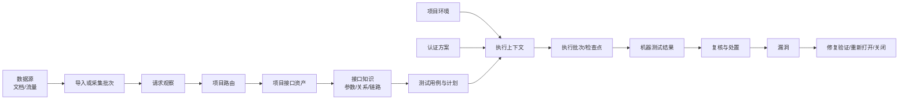
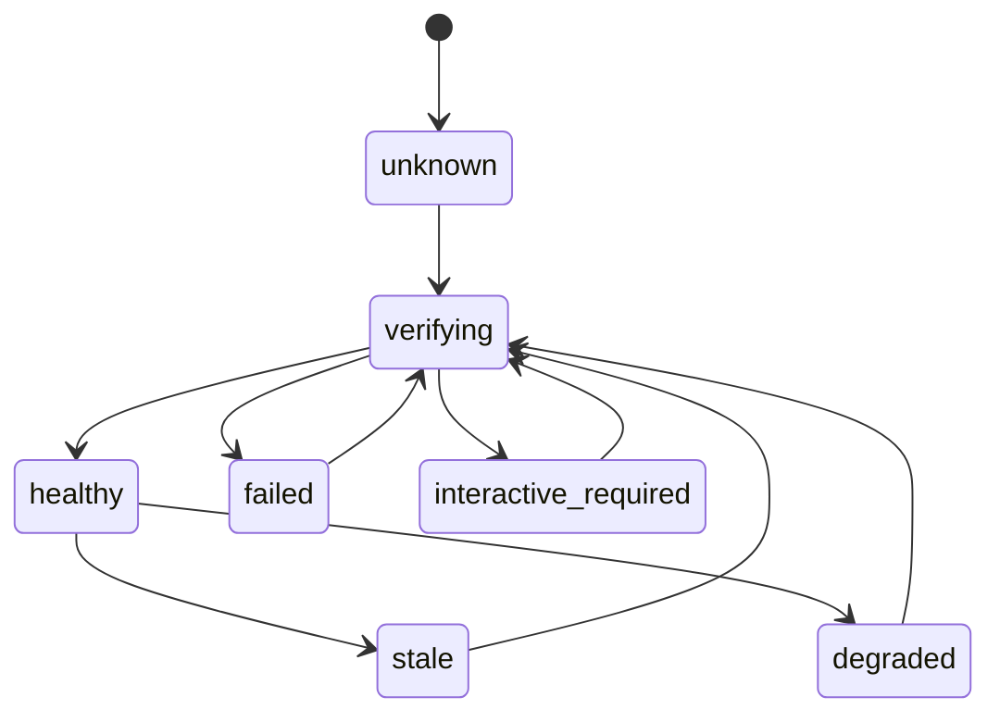
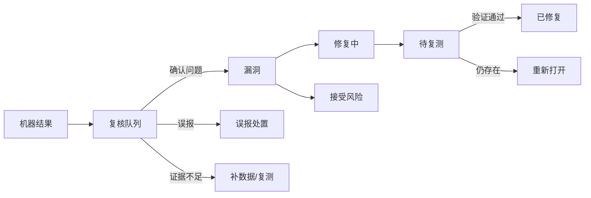

# API Manager V2 领域架构与迁移定稿

- 状态：P0-B 认证架构已实施；P1-A 数据源、导入批次和项目路由闭环已实施
- 日期：2026-07-24
- 适用范围：`api_manger` 本地个人项目
- 产品目标：内部授权 API 测试、接口知识沉淀、安全测试编排和漏洞闭环

## 1. 已确认的架构决策

本文件固化以下已经确认的产品决策，后续实现不再沿旧
`Workspace = 流量 + 认证 + 项目` 模型继续扩展。

1. `ApiProject` 是接口资产、接口知识、测试计划和漏洞的业务边界。
2. 数据源独立于项目。Apifox、OpenAPI、Postman、HAR、mitm 和实时流量
   先属于数据源，再通过显式绑定或逐条路由进入项目。
3. 接口知识属于项目；全局只保存参数归一化、语义角色、推断规则和显式
   发布的可复用模板，不共享项目事实。
4. 认证独立于流量和项目。项目环境只绑定认证方案，不嵌入 SSO 代码，
   不从任意 Workspace 猜测登录方式。
5. 认证以声明式配方优先，自定义代码适配器兜底。AI 可以生成两者，
   但生成物必须经过受控验证、版本化和启用流程。
6. 测试计划、执行批次、机器结果、人工复核和漏洞是五种不同对象。
   测试结果不自动等于漏洞。
7. 继续复用 `security_test_run`、`security_execution_checkpoint` 和
   `security_test_result` 作为执行主干，不为名称统一建立第二套任务/结果表。
8. 后端按领域拆分，前端按用户任务收敛。普通用户不直接面对认证域、
   适配器、配方和内部状态机。
9. 项目为个人项目，不保留旧页面和旧 API 的长期兼容层；迁移采用一次
   dry-run、一次正式切换，保留有价值历史证据，不进行长期双写。

## 2. 产品信息架构

### 2.1 全局入口

```text
工作台
项目
数据源
全局执行记录
漏洞中心
扩展与设置
```

### 2.2 项目内部入口

```text
项目概览
环境与认证
接口资产
接口知识
  - 参数资产
  - 关系验证
  - 链路编排
测试与自动化
项目漏洞
```

“全局执行记录”和“漏洞中心”是跨项目投影视图，不形成第二份数据。
接口知识不再作为脱离项目的数据空间；进入接口知识前必须具有明确
`project_id`，需要执行或查看真实样本时再选择 `env_id`。

## 3. 核心数据流



任何真实请求都必须能够追溯到以下引用链：

```text
project_id
-> env_id
-> source_id / import_run_id（存在来源证据时）
-> auth_profile_id（认证执行时）
-> test_plan_id / plan_version
-> request_snapshot_id
-> run_id / checkpoint_id
-> result_id
-> review_event_id（经过复核时）
-> finding_id（确认成漏洞时）
```

引用可以为空的唯一原因是对象在对应阶段尚未进入该领域。例如未路由的
流量没有 `project_id`；尚未确认的机器结果没有 `finding_id`。不能使用
其他项目或环境的默认值静默补齐。

## 4. 领域边界

### 4.1 项目领域

项目领域负责：

- 稳定项目身份、名称和状态；
- 项目环境、业务 Host、请求预算和写操作策略；
- 项目接口资产的唯一归属；
- 项目账号别名、角色和测试账号标记；
- 项目级页面导航和默认筛选上下文。

项目领域不负责：

- 保存导入文件或未路由流量；
- 实现登录协议；
- 保存 Token/Cookie；
- 调度 worker；
- 直接修改机器结果或漏洞证据。

目标模型：

| 模型 | 决策 |
| --- | --- |
| `ApiProject` | 保留，作为稳定项目主表 |
| `ProjectEnvironment` | 保留并扩展，负责业务 Host 与执行安全策略 |
| `ProjectAssetLink` | 保留为项目资产来源/归属证据，不作为接口事实本体 |
| `ProjectAccountBinding` | 保留语义，UI 改称“项目账号”；不承担登录有效性 |

### 4.2 数据源领域

数据源负责“数据从哪里来”，项目负责“数据属于什么业务”。两者是多对多
关系，不允许把流量工作空间当成项目。

目标对象：

- `DataSource`：稳定来源，例如一个 Apifox 项目、OpenAPI 地址、HAR 集合、
  mitm 采集器或实时采集空间；
- `ImportRun`：一次不可变的导入/采集批次；
- `RequestObservation`：脱敏的原始请求观察；
- `ObservationRoutingDecision`：每条观察的自动或人工路由决定；
- `ProjectSourceBinding`：数据源与项目/环境之间的显式绑定和路由规则；
- `request_sample`：已经归属到项目资产后的有界真实样本。

规则：

1. `DataSource` 只保存非秘密配置和来源身份，不保存认证凭据。
2. 实时“采集空间”是 `DataSource(type=live_capture)` 的用户界面名称，
   不再是独立认证容器。
3. 混合流量先写 `RequestObservation`，经路由后才生成/补充项目资产和样本。
4. 新的 `raw_data` 必须具有项目归属；未归属流量不得提前写成项目资产。
5. 新的 `request_sample` 必须具有 `project_id`、`env_id`、`source_id` 或
   `import_run_id`，并引用明确项目资产。
6. 登录流量可以作为 AI 推断认证流程的脱敏输入，但不会成为认证配置或
   凭据来源。

### 4.3 接口知识领域

接口知识由项目接口资产派生，包含参数资产、字段关系和业务链路。

| 知识 | 归属范围 |
| --- | --- |
| 参数别名、词法归一化、通用语义角色规则 | 全局规则版本 |
| 参数在具体接口中的语义、重要度和人工经验 | 项目 |
| 参数真实样本、出现频率、最近观察时间 | 项目 + 环境 + 数据源 |
| 来源/消费字段候选关系 | 项目 |
| 关系真实验证结论 | 项目 + 环境 + 认证方案 |
| 业务链路拓扑 | 项目 |
| 链路在当前环境是否可执行 | 项目 + 环境 |

全局规则只能生成候选和分数。某项目已验证的 `user_id` 关系不能自动成为
另一个项目的事实；跨项目经验必须由用户显式“发布为模板”，其他项目应用
后仍保持待验证状态。

目标模型继续复用：

- `parameter_priority_item`：归一化参数资产与机器排序；
- `parameter_experience`：项目人工经验；
- `parameter_relation`：项目字段边及其当前可信状态；
- `parameter_validation_result`：环境/认证方案相关的验证结果；
- `interface_chain_feedback`：人工链路归档和覆盖，不复制链路投影。

参数关系、优先级和链路页面均使用同一个项目上下文，不再恢复旧的重复
参数中心。

### 4.4 认证领域

认证领域不属于流量，也不属于某一个项目。项目环境通过认证方案引用它。

目标对象：

| 对象 | 职责 |
| --- | --- |
| `TestAccount` | 稳定测试账号身份；没有脱离认证域的全局“有效”状态 |
| `CredentialVersion` | 不可变的账号凭据版本；账号只保存当前版本引用 |
| `AuthAdapter` | 稳定认证适配器身份和类型 |
| `AuthAdapterVersion` | 不可变的 Recipe 或受控 Provider manifest 版本、能力和内容哈希 |
| `AuthRealm` | 稳定登录边界身份，不直接保存可变端点 |
| `AuthRealmRevision` | 不可变的认证端点、TLS、跳转、身份验证接口和适配器版本 |
| `AuthRealmSecretVersion` | 不可变的 Realm 共享协议秘密版本；Recipe 只按键名引用，不包含秘密值 |
| `ProjectAuthProfile` | 项目环境中一个“登录功能点 + 角色 + 模式 + 账号别名”的稳定可选身份 |
| `ProjectAuthProfileRevision` | 不可变的项目账号、Realm Revision、注入策略和业务 Host 限制 |
| `AuthProfileHealth` | 可重建的当前认证健康投影 |
| `AuthVerificationAttempt` | 有 TTL 的显式验证、修复诊断和请求计数 |
| `AuthRepairCandidate` | 连接旧/新不可变版本，协调候选验证、激活和可选批次改绑 |
| `AccountContext` | 现有进程内短期 Header/Cookie/过期时间合同；不持久化 |

认证方案负责验证，账号表只负责保存凭据版本。相同账号可能在一个认证域可用，
在另一个认证域被拒绝，因此不能因单次 401 把账号全局标记为失效。

版本引用链固定为：

```text
AuthAdapter -> AuthAdapterVersion
AuthRealm -> AuthRealmRevision -> AuthAdapterVersion
                              -> AuthRealmSecretVersion（可选）
ProjectAuthProfile -> ProjectAuthProfileRevision -> AuthRealmRevision
security_test_run / request_snapshot -> profile_revision + realm_revision + adapter_version
```

项目和环境没有唯一“当前 Recipe”。同一项目可以同时启用多个
`ProjectAuthProfile`，例如后台管理员密码登录、普通用户短信登录和合作方 SSO。
Recipe 的稳定身份由 `recipe_key` 表达；Profile 只固定引用某个不可变版本。
同一 Recipe 可以被多个 Profile 复用，更新一个 Profile 的当前 Revision 不得
隐式切换其他 Profile。

执行器继续只认识现有 `AccountContext`。认证 Recipe Provider 是
`AccountContextProvider` 的上游实现，不再创建新的 Session 模型或第二条凭据
注入路径。

#### 认证实现层级

1. **声明式配方优先**：HTTP 请求、JSON/Form、跳转、Cookie Jar、字段提取、
   时间戳、UUID、MD5/SHA/Base64、字符串组合和身份验证接口。已知协议可以
   发布为版本化 Recipe 模板，但模板只是数据和默认值，不能新增产品专属页面、
   专属字段或执行分支。蒲公英流程在真实协议验证完成前只能作为候选 Recipe，
   不能作为固定产品模型。
2. **管理员可信代码适配器兜底**：个人部署允许管理员安装
   `get_auth(username, password)` Python 插件，用于特殊签名、挑战响应或
   SDK 协议。当前以独立子进程、超时、受限导入、请求预算和 Origin 白名单
   提供低成本防护，但不宣称能够安全运行敌对代码。
3. **交互式适配器**：浏览器登录、MFA、验证码或人工首次引导。

AI 生成物不能直接作为数据库字符串执行。认证版本记录保存 manifest、
配方或受控代码引用、哈希和验证状态；代码适配器通过注入的受限 HTTP
客户端、秘密读取器和脱敏日志器运行，不能自行读取任意文件、环境变量或
访问未允许 Host。

P0-B 的通用运行主干仍以声明式 Recipe 为首选。管理员可信代码仅作为个人
部署的显式插件模式启用；不可信用户代码或未经管理员审核的 AI 代码必须等到
P2 具备容器或操作系统级隔离后才能运行。

#### Host 与 TLS 所有权

- `AuthRealmRevision` 唯一拥有登录、跳转和身份验证 Host；
- `ProjectEnvironment` 唯一拥有业务 Host；
- `ProjectAuthProfileRevision` 只能缩小业务 Host，不能扩展；
- Recipe 运行时只能访问 Adapter 权限与 Realm Revision 认证 Host 的交集；
- `AccountContext.allowed_hosts` 取环境业务 Host 与 Profile 限制的交集；
- Host 保存为规范化 `scheme + host + port`，运行时再按用途取 hostname；
- TLS 默认严格验证。关闭验证必须由人工显式配置并持续显示警告，AI 不得
  自动关闭。

#### 普通用户流程

```text
选择项目环境
-> 添加测试账号
-> 自动识别并验证登录
-> 显示可用或结构化修复建议
-> 仅在需要时进入独立“认证域修复工作台”
```

项目页只展示方案状态、最近诊断和“高级认证 / 修复认证域”入口。认证域、
适配器、配方、Realm 共享密钥键名和版本历史只在独立高级工作台展示；
秘密值永不回显。

#### 配置生命周期与健康状态

配置生命周期和运行健康必须分离。

```text
AuthAdapterVersion / AuthRealmRevision / AuthRealmSecretVersion:
draft -> validated -> active -> retired
ProjectAuthProfile: draft -> active -> disabled -> retired
TestAccount: active -> retired
```

`AuthProfileHealth` 是由最近验证尝试和运行失败重建的投影：



`AuthVerificationAttempt` 只在用户显式验证、故障修复或健康状态变化时追加，
保存阶段、请求计数、结构化错误和脱敏摘要，并按 TTL 清理。普通 Token 刷新
不为每次刷新创建记录。

认证域修复不原地修改任何版本。常见账号密码登录由快捷配置生成 Recipe；
所有多步登录统一使用通用工作流编辑器，原始 JSON 只是专家入口。产品模板
可以预填同一个编辑器，但不得产生产品专属表单。保存候选不发送请求，用户
显式点击验证后才执行有上限的认证请求。Realm 共享协议秘密先生成独立
`AuthRealmSecretVersion`，
Recipe 只使用 `{{secret.key}}` 引用。随后统一生成新的
`AuthAdapterVersion -> AuthRealmRevision -> ProjectAuthProfileRevision`，再由
`AuthRepairCandidate` 记录旧/新版本。候选验证失败只更新候选健康和尝试记录，
当前 Profile 指针保持不变；候选验证成功后才以 CAS 切换 Profile，并更新
Realm 当前版本及其共享秘密版本。

快捷导入与故障修复是两个不同入口：`/auth-import` 对管理员显式选择的 Profile
执行本地静态校验后直接激活，不发送认证或业务请求；高级修复工作台用于替换
已在运行的故障配置，继续执行候选、显式请求预算验证和 CAS 激活。快捷导入
允许 Token URL 和管理员可信 Python，详细边界见 `docs/auth_import.md`。

失败必须是结构化分类，而不是原始异常文本：

- `CONFIG_INVALID`
- `AUTH_HOST_UNREACHABLE`
- `CREDENTIAL_REJECTED`
- `MFA_OR_INTERACTION_REQUIRED`
- `LOGIN_PROTOCOL_CHANGED`
- `TOKEN_EXTRACTION_FAILED`
- `SESSION_ESTABLISH_FAILED`
- `IDENTITY_VERIFY_FAILED`
- `BUSINESS_AUDIENCE_MISMATCH`
- `RATE_LIMITED`
- `ADAPTER_RUNTIME_ERROR`

认证失败时执行批次进入 `paused`，不发送业务请求、不创建重复批次，也不把
参数关系判为失败。修复并验证成功后恢复原批次。

暂停运行必须记录 `pause_code`、`dependency_type=auth_profile`、
`dependency_id`、实际解析的 Profile/Realm/Adapter 版本。修复成功后使用新
`context_ref`，不会命中旧 `AccountContextResolver` 缓存。仅当原运行还没有
检查点尝试、业务结果或完成/失败计数时，系统才克隆该运行引用的请求快照、
更新嵌套来源/消费认证引用，并把认证依赖精确改绑到新 Profile Revision；
随后再以 CAS 恢复原运行。已有业务执行进度的运行不得改写，应由用户创建
新运行。页面不得直接运行多步认证逻辑，
而应调用独立认证服务并写入 `AuthVerificationAttempt`；认证尝试不伪装成
`security_test_run/security_test_result`。

### 4.5 测试与自动化领域

该领域拆分“测试什么”和“如何运行”：

- 测试定义/用例：可复用的测试意图、输入要求和断言；
- 测试计划：一次明确的接口范围、策略版本、账号角色和预算；
- 请求快照：本次执行的不可变请求合同；
- 测试适配器：越权、未授权、关系验证、链路验证或外部工具适配；
- 执行批次：队列、租约、暂停、取消和恢复；
- 检查点：逐请求快照的轻量运行状态；
- 机器结果：不可变的脱敏结论和证据引用。

“越权任务”不再是单独顶层领域，而是测试策略/适配器的一种。新的计划和
用例必须项目化；旧的全局 `test_case` 和 `privilege_task` 不再扩展。

执行继续复用：

- `request_snapshot`
- `security_test_run`
- `security_execution_checkpoint`
- `security_test_result`

机器结果保留具体 `verdict`，同时增加统一 `outcome_class` 投影：

| outcome_class | 含义 |
| --- | --- |
| `pass` | 机器证据支持通过/未发现问题 |
| `candidate` | 有问题信号，需要复核或明确自动确认规则 |
| `review` | 语义、所有权或影响不清楚 |
| `blocked` | 缺数据、缺认证、环境或前置条件不满足 |
| `error` | 执行器、传输或服务异常 |
| `informational` | 关系、覆盖、性能等非漏洞结论 |

`security_test_result` 的机器字段一旦写入不再被人工覆盖；人工处置写入独立
复核事件。

#### 执行状态

沿用现有 scheduler 状态，不增加第二套状态机：

```text
preparing -> queued -> running -> done
                        |  |  |
                        |  |  -> failed
                        |  -> paused -> queued
                        -> cancel_requested -> cancelled
```

`paused` 表示可恢复的外部上下文问题，例如认证、业务数据或人工批准；
`failed` 只表示执行引擎或不可恢复的计划错误。

### 4.6 结果复核与漏洞领域

测试结果与漏洞必须拆开。

目标对象：

- `ResultReviewEvent`：针对机器结果的追加式人工/规则处置事件；
- `VulnerabilityFinding`：稳定漏洞聚合，引用一个或多个结果；
- `FindingEvent`：修复、复测、接受风险、重新打开和关闭历史。

处理流程：



规则：

1. `potential_vuln` 和 `need_review` 进入复核队列，不自动生成漏洞。
2. AI 可以归类、去重和解释证据，不能单独确认漏洞成立。
3. 漏洞可以关联多次运行和多个结果；结果只关联一个当前漏洞聚合。
4. 修复验证创建新的运行和结果，并通过 `FindingEvent` 关联，不覆盖原证据。
5. 漏洞页面只显示脱敏证据摘要；真实私有证据继续使用受控引用。

漏洞状态：

```text
open -> fixing -> fixed_pending_verify -> verified_fixed
  |        |              |
  |        |              -> reopened -> fixing
  |        -> accepted_risk
  -> false_positive
  -> accepted_risk
```

`closed` 是展示归档状态，不替代关闭原因；关闭原因必须是
`verified_fixed`、`false_positive` 或 `accepted_risk` 之一。

### 4.7 扩展领域

扩展领域负责版本化的认证适配器、测试适配器和未来导入适配器。

统一生命周期：

```text
draft -> validating -> validated -> active -> degraded -> retired
```

每个版本不可变，包含：

- 扩展类型和稳定 ID；
- 语义版本；
- manifest 和能力声明；
- 代码/配方引用与哈希；
- 允许 Host 和运行时权限；
- 自动测试结果；
- 创建者、AI 生成标记和审核记录；
- 替代版本和回滚目标。

当前 `/code-review` 实际是安全结果修复队列，应并入漏洞/复核领域。未来
AI 生成的认证或测试代码使用独立“适配器审核”页面，二者不能继续混用。

## 5. 数据所有权和写入规则

| 数据 | 唯一写入领域 | 其他领域使用方式 |
| --- | --- | --- |
| 项目/环境 | 项目 | 只引用 ID |
| 数据源/导入批次/观察 | 数据源 | 路由或读取投影 |
| 接口资产 | 项目资产 | 知识、计划引用 |
| 参数/关系/链路知识 | 接口知识 | 计划读取，不直接执行 |
| 测试账号秘密 / Realm 共享秘密 | 认证 | 以不可变版本保存；仅在认证运行时解析到内存，不进入 Recipe、页面、任务、结果或日志 |
| Token/Cookie | 认证运行时 | 仅内存注入，不持久化 |
| 请求快照 | 测试计划/组合器 | 执行器只读 |
| 批次/检查点 | 执行调度 | 页面读取投影 |
| 机器结果 | 结果写入器 | 复核只追加事件 |
| 漏洞 | 漏洞领域 | 执行通过 finding_id 回链 |

禁止行为：

- 页面直接发送业务请求；
- 认证适配器直接写测试结果；
- 执行器修改参数关系的人工结论；
- 人工复核覆盖机器证据；
- 漏洞记录复制完整响应体或凭据；
- 数据源根据单一 Host 静默猜测项目；
- 任意项目复用另一个项目的参数值、认证方案或链路结论。

## 6. 保留策略

- Token、Cookie、短期会话：仅内存，进程退出或过期后消失；
- `AuthVerificationAttempt`：默认保留 7 天，只含脱敏阶段和错误摘要；
- 导入文件、HAR、flow、原始私有样本：继续留在忽略的本地私有目录；
- `request_sample`：按项目接口保存有界代表样本；
- 关系验证临时计划、检查点和通用结果：保持 7 天 TTL；
- 机器安全结果：长期保留脱敏摘要，除非明确属于临时分析；
- 复核事件、漏洞和修复验证：长期保留；
- 删除关系：保留最小 tombstone，避免自动重新发现；
- 被替代适配器：保留 manifest、哈希和历史引用，停止新执行。

## 7. 当前数据盘点与迁移决定

2026-07-22 只读盘点，不含账号、Token、Cookie 或响应内容：

| 当前对象 | 数量 | V2 决定 |
| --- | ---: | --- |
| `ApiProject` | 3 | 保留 |
| `ProjectEnvironment` | 3 | 保留并扩展 |
| `ProjectSourceBinding` | 3 | 迁移为 DataSource 引用 |
| `ProjectAssetLink` | 2513 | 保留来源/归属证据 |
| `raw_data` | 2632 | 保留项目资产；119 条未归属记录隔离处理 |
| `request_sample` | 106 | 全部暂未归属项目/环境，迁入待路由区，不自动猜测 |
| `ImportRun` | 0 | 保留模型，新导入开始强制写入 |
| `RequestObservation` | 0 | 保留模型，成为混合流量入口 |
| `Workspace` | 2 | 删除旧领域；无 PacketRecord 可迁移 |
| `WorkspaceSso` | 2 | 迁成待验证 AuthRealm 草稿 |
| `WorkspaceAuth` | 0 | 删除 |
| `PacketRecord` | 0 | 删除旧入口；新流量写 observation/sample |
| `SsoAccount` | 5 | 迁为 TestAccount；不在迁移时验证账密 |
| `ProjectAccountBinding` | 1 | 迁为项目账号 |
| `ProjectAuthProfile` | 1 | 迁到明确 AuthRealm，保留当前错误诊断 |
| `parameter_relation` | 4839 | 保留，补齐严格项目/环境引用 |
| `parameter_priority_item` | 4065 | 保留 |
| `parameter_experience` | 4 | 保留为项目经验 |
| `interface_chain_feedback` | 0 | 保留模型，用于后续人工归档 |
| `security_test_run` | 141 | 保留历史和调度主干 |
| `security_execution_checkpoint` | 1 | 保留 |
| `security_test_result` | 3474 | 保留历史机器结论 |
| `privilege_task` / `privilege_config` | 0 / 0 | 删除旧领域，越权接入测试计划/适配器 |
| `vuln_record` | 0 | 用新的 Finding 结构替换，无历史迁移负担 |
| `api_version` | 0 | 删除；版本归各自领域对象 |
| `test_case` | 0 | 删除旧全局用例，建立项目化测试定义/计划 |

当前机器结果中有 9 条 `potential_vuln`、52 条 `need_review`，而漏洞记录为
0。V2 不自动将这些结果提升为漏洞；迁移后进入去重的结果复核队列。

当前一个运行处于 `running`、一个运行处于 `paused`。任何正式迁移前必须
先让运行进入稳定状态或显式暂停，避免状态迁移与 worker 同时写入。

个人项目当前不把历史样本脱敏作为 P0-B 切换阻断项，现有
`request_sample` 和 `request_snapshot` 本轮不改。新认证 Recipe 仍不得把
账号、密码、Token 或 Cookie 写入代码、日志、任务和验证尝试；业务执行所需
认证值继续只由运行时 `AccountContext` 注入。历史样本治理延后单独处理，
Recipe 不从历史流量复制认证值。

## 8. 旧页面到新页面的映射

| 当前入口 | V2 入口 | 处理方式 |
| --- | --- | --- |
| 工作空间 | 数据源 / 实时采集 | 删除认证职责后迁移 |
| 接口管理 | 项目 / 接口资产 | 项目化 |
| 数据导入中心 | 数据源 / 导入与路由 | 保留能力，重做上下文 |
| 项目与执行中心 | 项目 + 全局执行记录 | 拆分视图，不复制数据 |
| 项目环境与认证 | 项目 / 环境与认证 | 使用新认证领域 |
| 接口知识中心 | 项目 / 接口知识 | 保留三个任务视图 |
| 自动化操作中心 | 项目 / 测试与自动化 | 拆分用例、计划、运行 |
| 越权任务 | 测试策略 / 越权 | 删除旧独立任务页 |
| 安全结果 | 复核队列 | 机器结果与处置分离 |
| 漏洞管理 | 项目漏洞 + 漏洞中心 | 使用 Finding/Event |
| 代码待确认 | 漏洞 / 修复协作 | 当前页面合并到漏洞领域 |
| 版本管理 | 各领域版本历史 | 删除笼统版本页面 |
| 用例管理 | 项目 / 测试与自动化 | 使用项目化测试定义 |
| 账号管理 | 扩展与设置 / 测试账号 | 账号与认证状态分离 |

V2 路由以项目资源为中心，例如：

```text
/projects
/projects/<project_id>
/projects/<project_id>/environments/<env_id>/auth
/projects/<project_id>/assets
/projects/<project_id>/knowledge/parameters
/projects/<project_id>/knowledge/relations
/projects/<project_id>/knowledge/chains
/projects/<project_id>/tests
/projects/<project_id>/runs
/projects/<project_id>/findings
/sources
/runs
/findings
/extensions
```

旧路由在 V2 切换后直接移除，不建立长期重定向或双写逻辑。

## 9. 迁移原则

1. 每个迁移脚本默认 dry-run，`--apply` 才写入。
2. 迁移前记录集合数量、关键引用缺口和正在运行的批次，不导出秘密值。
3. 先创建新结构和索引，再迁移可唯一证明的数据。
4. 无法唯一归属的数据进入待路由/待验证状态，不猜测项目、环境或认证域。
5. 迁移认证账号时只移动引用和秘密记录，不发登录请求。
6. 认证真实验证是迁移后的显式步骤，使用独立认证请求预算。
7. 不长期双写；通过迁移测试后一次切换读写路径。
8. 切换完成并核对引用后，删除旧模型、路由、模板和菜单入口。
9. 历史运行、结果和证据引用必须保留；空的旧功能表可以直接删除。
10. 任何不可逆删除前保留可恢复的本地数据库备份或集合导出。
11. 认证迁移先创建稳定身份、不可变 Revision、索引和迁移日志；旧
    `WorkspaceSso` 只能生成 `unverified` Realm Revision 草稿。
12. Profile 只按显式旧引用映射；无法唯一映射时标记 `needs_repair`，禁止
    使用“第一条 Workspace SSO”或全局 URL 回退。
13. 在新认证验证成功、运行版本引用和无秘密审计通过前，不切断旧 provider；
    callback/local JSON provider 保留在注册表中。

## 10. 实施顺序

### P0-B：认证领域和当前 SSO

1. 增加 `TestAccount/CredentialVersion`、Adapter/Version、
   Realm/Revision/SecretVersion、Profile/Revision、Health、
   VerificationAttempt 模型、索引和迁移日志。
2. 扩展快照与运行版本引用、认证依赖暂停字段和精准 CAS 恢复合同。
3. 默认 dry-run 迁移旧账号、两套 SSO 草稿和显式 Profile 引用，不发登录请求。
4. 建立受控声明式 Recipe 执行器，输出唯一的现有 `AccountContext`。
5. 为当前测试环境人工确认 Realm Revision，把登录流程实现为第一份配方并
   进行独立、限额、结构化认证验证。
6. 单独切换当前 Profile 到新 provider；验证失败时必须确认业务请求为零。
7. 验证成功后清理对应缓存，只恢复因该 Profile Revision 暂停的原批次，
   确认没有重复快照或请求案例。
8. 普通项目页只保留“添加账号 -> 自动识别并验证 -> 状态/修复入口”；
   独立高级工作台展示 Realm、Revision、Recipe、TLS、候选历史和共享秘密
   键名，并为蒲公英三阶段认证提供可读模板。
9. 其他明确 Profile 逐个切换后，才移除全局 SSO URL、第一条 Workspace
    回退和旧项目认证写入口；旧集合在备份与引用核对后删除。

验收标准：

- 当前测试环境认证能够得到明确成功或准确失败分类；
- 不同项目/环境的认证入口互不影响；
- 认证失败前不发送业务请求；
- Token/Cookie 不进入数据库、任务、结果和日志；
- 修复后恢复原暂停批次，不生成重复请求案例。
- 每次认证执行和业务运行都能还原实际 Profile/Realm/Adapter 版本；
- 登录 Host、业务 Host 和 TLS 权限不存在隐式扩大；
- 代码、日志、任务和验证尝试中不出现账号密码、Token 或 Cookie；历史样本
  脱敏作为非阻断后续治理项。

### P1-A：数据源和项目路由

实施状态：核心闭环已完成。

1. 已增加稳定 `DataSource`，来源身份与项目、认证分离。
2. 3 个 Apifox 来源绑定已迁为 DataSource 引用。
3. 2 个旧 Workspace 已建立实时采集 DataSource 身份；旧采集页面后续只保留
   采集控制，不再扩展认证职责。
4. 新的 OpenAPI、Postman 和 HAR 文件导入均强制创建 `ImportRun`。
5. 未显式选择项目的混合流量先写脱敏 `RequestObservation`，再路由到项目；
   未归属数据不提前生成项目资产。
6. 106 条未归属 `request_sample` 和 22 条无样本 `raw_data` 已转换为
   128 条脱敏观察并进入待路由区；其余 97 条 raw_data 由上述样本覆盖。
7. 路由页面支持逐条纠偏、同来源 + Host 批量确认、非业务流量忽略、
   精确接口结构学习，以及来源绑定新增/停用。
8. 人工最终结论通过追加决策纠偏，重复采集不会覆盖人工确认或忽略结论。
9. 项目执行中心已移除来源绑定和路由编辑，只保留持久化执行生命周期。

验收标准：每个进入接口知识的样本都能解释项目、环境和来源；无法解释的
数据不会参与参数频率、关系验证和链路执行。

### P1-B：测试计划、执行和复核

实施状态：统一执行/结果契约、进程拆分和复核队列已完成。

1. 建立项目化测试定义和版本化 TestPlan。
2. 将越权能力注册为测试适配器。
3. 统一创建 request_snapshot 后调度现有 security_test_run。
4. 增加统一 outcome_class，不覆盖历史 verdict。
5. 将 evidence_summary 内的人工处置迁为追加式 ResultReviewEvent。
6. 删除空的 privilege_task、privilege_config 和旧 testcase 页面。

### P1-C：漏洞生命周期

实施状态：机器结果、人工事件、稳定漏洞对象和证据复测闭环已完成。

1. 建立 VulnerabilityFinding 和 FindingEvent。
2. 将结果复核、去重、提升和修复验证组成闭环。
3. 项目漏洞和全局漏洞中心共享同一数据源。
4. 候选/待复核结果经去重和替代关系进入复核队列，不自动生成漏洞。
5. 删除空的 vuln_record 旧结构和重复“代码待确认”入口。

### P2：AI 与复杂扩展

1. AI 从脱敏文档/流量生成认证配方。
2. 为不可信或 AI 生成代码增加容器/操作系统级隔离、资源配额和测试后启用
   流程；管理员可信插件模式不等同于该安全边界。
3. 增加浏览器/MFA/交互式认证模式。
4. 将同一扩展合同推广到安全测试和外部工具适配器。
5. 增加版本验证、启用、降级、回滚和退役页面。

### P3：规模化自动分析

1. 批量关系验证和链路执行使用稳定认证/来源上下文。
2. 新接口导入后增量发现关系、重算链路和标记陈旧结论。
3. 小请求量自动运行，大批量或高影响操作进入确认队列。
4. 从执行证据自动生成复核候选，而不是直接生成漏洞。

## 11. P0-A 完成标准

本架构定稿满足以下条件后，才进入认证代码改造：

- 每类数据有唯一写入领域；
- 接口知识明确属于项目；
- 数据源、项目和认证互相独立并通过引用组合；
- 执行主干继续复用现有 run/checkpoint/result；
- 机器结果、复核和漏洞完全分离；
- 普通认证流程保持三步，复杂能力采用渐进披露；
- 旧模型和页面均有明确迁移、删除或保留决定；
- 当前有价值历史数据具有无秘密、可回滚的迁移路径。

P0-B 的模型、Recipe 运行时、迁移、诊断页面、候选修复/激活和零进度批次
改绑恢复代码已实施。
当前真实验证在 1 次请求内得到 `CREDENTIAL_REJECTED`，另一文档候选在 1 次
请求内得到 `LOGIN_PROTOCOL_CHANGED`；业务请求为 0，原批次保持暂停。账号或
真实协议仍需由用户在修复工作台中确认并显式验证；成功后代码会切换新版本并
恢复原批次。P1-A、P1-B 和 P1-C 的核心闭环已经完成；旧 Workspace Web、
捕获和同步重放入口已从运行时删除，历史集合仅供显式迁移工具读取。

## 12. 当前第三阶段实现

第三阶段不使用固定双账号越权模型。`AuthorizationPrincipal` 提供任意数量身份，
`AuthorizationPolicy`/`AuthorizationPolicyRule` 以不可变版本描述角色、等级、
作用域、标签、自定义属性、资源族与 action。执行时完整展开
`访问主体 × 资源归属主体 × 资源组`，超过显式预算即拒绝，不进行静默截断。
详细合同见 [`authorization_matrix.md`](authorization_matrix.md)。

请求 Fixture 已拆为稳定对象、不可变 Revision 和追加式 Event；关系验证计划固定
当前 Revision。授权策略激活时冻结认证 Profile Revision 和已验证关系指纹；发生
漂移后必须创建新策略版本。漏洞复测只重放关联机器结果的不可变快照，明确通过才
关闭、候选复现才重新打开，不完整证据保持待验证。

Web、execution worker、relation worker 和 maintenance scheduler 已成为四个独立
进程。导入只通过 `import.v1`，执行只通过持久化 scheduler，机器结论只通过
`result.v1`；Web 不直接执行业务重放或结果写入。用户显式触发的认证 Profile
健康检查仍是有独立 Attempt、请求上限和脱敏诊断的控制面操作。
