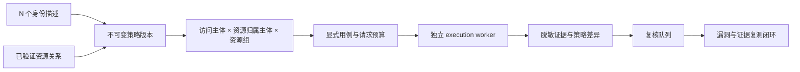

# 多身份授权矩阵

## 目标

授权测试不使用固定“双账号”模型，也不把权限简化成单一等级比较。一个项目可声明
任意数量的测试身份，并以版本化规则描述角色、等级、组织作用域、标签和项目自定义
属性之间的授权预期。



## 领域对象

- `AuthorizationPrincipal`：项目内的逻辑测试身份，绑定一个认证 Profile，并保存
  `role_key`、`privilege_rank`、`scope_key`、标签和非敏感自定义属性。身份数量没有
  固定上限，等级只是选择器维度之一。
- `AuthorizationPolicy`：一个逻辑策略的不可变版本。草稿激活时冻结身份描述、认证
  Profile Revision、参数关系描述和关系指纹；变化后必须克隆下一版本。
- `AuthorizationPolicyRule`：按优先级匹配资源归属主体、访问主体、作用域关系、资源族
  和 action，输出 `allow`、`deny` 或 `review`。
- `AuthorizationMatrixCase`：某次运行中一个有序矩阵单元的观察。它保留策略预期、
  实际决策和规则引用，不保存真实资源 ID、Token、Cookie 或响应正文。

## 选择器

规则可以组合以下字段，而不是依赖固定角色枚举：

| 维度 | 字段 | 示例用途 |
| --- | --- | --- |
| 明确身份 | `principal_ids`、`profile_ids`、`account_keys` | 特殊服务账号或例外账号 |
| 角色 | `role_keys` | 管理员、部门管理员、成员、访客 |
| 等级 | `min_privilege_rank`、`max_privilege_rank` | 项目自定义等级区间 |
| 作用域 | `scope_keys`、`scope_relation` | 同部门、跨部门、同租户、跨租户 |
| 标签 | `labels_all`、`labels_any` | 内部员工、外包、服务账号 |
| 自定义属性 | `attributes` | 区域、组织类型、许可证或业务线 |

`scope_relation` 支持 `any`、`same` 和 `different`。高优先级规则先匹配；没有规则时
使用策略的同身份默认值或一般默认值。自定义属性禁止保存认证、Token、Cookie、密码、
私钥等材料。

## 完整矩阵与预算

对 `N` 个身份、`R` 个资源组：

- 包含同身份基线时，用例数为 `N × N × R`；
- 排除同身份基线时，用例数为 `N × (N - 1) × R`。

策略必须显式设置 `case_budget` 和 `request_budget_per_case`。若完整矩阵超过预算，创建
运行会失败并报告完整所需数量，不会静默截断。这可以避免身份数量增加后只覆盖矩阵
前半部分。

当前 `authorization_matrix` action 适配器执行只读资源访问。未来写入、审批、导出等
action 可以注册新的执行适配器；写操作必须带回读、补偿或清理契约，不需要修改身份、
策略或矩阵模型。

## 执行和判断

运行使用 `auth_mode=matrix`，不绑定单一 run-level account。每个快照内部只保存两个
Profile Revision 引用：资源归属主体用于获取真实资源标识，访问主体用于请求消费接口。
认证材料仅由 worker 在内存中解析。

观察规则：

- 访问主体被 `401/403/404` 阻断，观察为 `deny`；
- 返回 `2xx` 且响应中完整匹配瞬时资源标识，观察为 `allow`；
- 部分匹配或业务响应不明确，进入人工复核；
- 策略预期 `deny` 但观察为 `allow`，产生 `potential_vuln`；
- 策略预期 `allow` 但被阻断，作为权限回归进入复核；
- 预期和实际一致时写入 `no_vuln`。

持久化证据仅包含状态码、结构、长度、哈希、匹配数量、策略版本、身份别名和关系定位器。
真实资源值、请求/响应正文、Bearer 和 Cookie 不进入 MongoDB 或 Git。

## CLI 工作流

以下命令只展示参数结构，实际 ID 从项目认证和参数关系页面取得：

```powershell
# 1. 为现有认证 Profile 创建任意数量的项目身份
python tools/manage_authorization_policy.py add-principal `
  --project-id <project-id> --env-id <env-id> --profile-id <profile-id> `
  --name <name> --role <role> --rank 20 --scope <scope>

# 2. 创建策略草稿，显式选择身份、关系和预算
python tools/manage_authorization_policy.py create-policy `
  --project-id <project-id> --env-id <env-id> --name <policy-name> `
  --principal-id <principal-a> --principal-id <principal-b> `
  --relation-id <verified-relation-id> --case-budget 100

# 3. 添加规则；selector 是 JSON 对象
python tools/manage_authorization_policy.py add-rule <policy-version-id> `
  --priority 200 --subject-json '{"role_keys":["manager"]}' `
  --scope-relation same --expected-decision allow

# 4. 激活不可变版本并调度完整矩阵
python tools/manage_authorization_policy.py activate <policy-version-id>
python tools/schedule_authorization_matrix.py <policy-version-id>
python tools/run_execution_worker.py --once
```

认证 Profile、身份描述、规则或参数关系发生变化时，使用 `clone` 创建下一草稿版本，
检查后再激活。既有运行与漏洞复测继续引用原始不可变快照。

## 修复复测闭环

漏洞进入修复后，从详情页选择“按原始证据安排复测”。系统只重放该漏洞关联结果的
不可变快照：

- 所有用例完整执行且全部为通过结论，状态自动进入 `verified_fixed`；
- 任一用例再次产生候选证据，状态自动进入 `reopened`；
- 证据不完整、认证失效、传输错误或仍需人工判断时，保持
  `fixed_pending_verify`，不会把不确定性当成已修复。

Web、execution worker、relation worker 和 maintenance scheduler 是四个独立进程；Web
不会执行授权矩阵、业务 API 请求或后台恢复。用户显式触发的认证 Profile 健康检查属于
有独立尝试记录和请求上限的控制面操作，不会运行安全测试用例。
